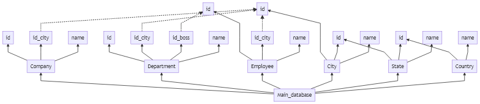

# Examples of skemator CLI and API usage

To check the `skemator API` examples, you should better go to `test/check.test.js`. You will find some `mocha` tests of the `skemator API`.

Alternatively, you can check those same `skemator cli` examples using the `skemator api`.

### `Skemator` files: from `*.skm` to `*.mmd`, `*.svg`, `*.png` and `*.pdf`

#### A complete example



```
#T2B
[Company]
 *(id)=Company_id
 *(id_city)=Company_id_city
 *(name)
[Department]
 *(id)=Department_id
 *(id_city)=Department_id_city
 *(id_boss)=Department_id_boss
 *(name)
[Employee]
 *(id)=Employee_id
 *(id_city)=Employee_id_city
 *(name)
[City]
 *(id)=City_id
 *(id_state)=State_id
 *(name)
[State]
 *(id)=State_id
 *(id_country)=Country_id
 *(name)
[Country]
 *(id)=Country_id
 *(name)
@Department_id_boss .-> @Employee_id
@Company_id_city .-> @City_id
@Department_id_city .-> @City_id
@Employee_id_city .-> @City_id

```

### `Bookmator` files: from `*.bkm` to files and folders

### `PlantUML` files: from `*.uml` or `*.plantuml` to `*.png`

### `Markdown` books: from `index.md`, `*.md` and folders to a `book.md`

