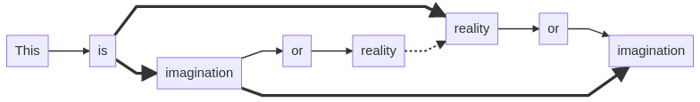

# skemator

To build diagrams via scripting.

## Index

- [Introduction](#introduction)
- [Installation](#installation)
- [Get started](#get-started)
- [Usage](#usage)
   - [CLI](#cli)
   - [API](#api)
   - [Browser](#browser)
- [Language](#language)
- [Versioning](#versioning)
- [Issues](#issues)
- [License](#license)

## Introduction

Welcome to the **`skemator` official documentation**.

By `skemator`, we can refer to:

  - **Skemator Project**: this whole set of tools.
  - **Skemator Language**: the programming language implementation of `skemator`.
  - **Skemator CLI**: the command-line interface of `skemator`.
  - **Skemator API**: the abstract programming interface of `skemator`.
  - **Skemator Online Editor**: a web application to use `skemator`.

## Installation

`$ npm i -g skemator`

## Get started

To start working with `skemator`, create the following file called `example1.skm`:

```
#L2R
[This]
 [is]
  ==>[imagination]=i1
   [or]=o1
    [reality]=r1
  ==>[reality]=r2
   [or]=o2
    [imagination]=i2
@i1 .-> @i2
@r1 .-> @r2

```


Then, from the console, you can type this to generate an image from your `*.skm` file:

`$ skemator compile example1.skm --png`

Automatically, a `example1.png` will be generated beside `example1.skm`. It should look like:



## Usage

Below, the CLI and API usages are explained.

### CLI

Syntax: `skemator {compile|watch} {command arguments}`

#### Compile example

Example: compiles `first.skm second.skm third.skm` and generates the `*.mmd *.png *.svg *.pdf` files.

`$ skemator compile first.skm second.smk third.skm --png --svg --pdf`

#### Watch example

Example: watches `first.skm second.skm third.skm` for changes and generates the `*.mmd *.png *.svg *.pdf` files.

`$ skemator watch first.skm second.smk third.skm --png --svg --pdf`

### API

#### Import module

```js
import Skemator from 'skemator';
```

...or...

```js
const Skemator = require("skemator");
```

#### Compile example

Example: compiles `first.skm second.skm third.skm` and generates the `*.mmd *.png *.svg *.pdf` files.

```js
Skemator.execute({
  command: "compile",
  files: ["first.skm", "second.smk", "third.skm"]
  png: true,
  svg: true,
  pdf: true
});
```

#### Watch example

Example: watches `first.skm second.skm third.skm` for changes and generates the `*.mmd *.png *.svg *.pdf` files.

```js
Skemator.execute({
  command: "watch",
  files: ["first.skm", "second.smk", "third.skm"]
  png: true,
  svg: true,
  pdf: true
});
```

### Browser

Browser is not supported yet.

<!--

For browser usage, import normally the package.

#### Compile (from browser) example

In browsers, we only have this method, which in Windows gives problems...

```js
Skemator.fromSkematorToSvg("#L2R\n[Hello]\n [World]\n  [!]=0\n").then(code => {
  console.log(code.svg);
  console.log(code.mmd);
});
```
-->

## Language

Every script read by this tool follows a specific set of grammar rules.

Every script is composed by the header (options, currently the direction) and the body.

### Script options

Each option has a new line character ('\n') at the end of it.

#### Diagram direction option

One of:

- `#L2R`: from left to right
- `#R2L`: from right to left
- `#T2B`: from top to bottom
- `#B2T`: from bottom to top

### Script body

Every body of a script is composed by sentences.

Every sentence is finished with a new line character (`\n`).

Below, the different types of sentences are explained.

#### Sentence type 1: Node sentence

Node: `  --some message-->[Node]=id`

...where...

- `  ` is the tabulation. **Optional**.
- `--some message` is the message of the relation with its parent. **Optional**.
- `-->` is the type of the relation with its parent. Optional, but needed for the message. It can be:
  - `-->` which is an arrow
  - `.->` which is a dotted arrow
  - `==>` which is a bold arrow
  - `---` which is a line
- `[Node]` is the of the node (`[`, `]`) and its text content (`Node`). **Required**. It can be:
  - `[...]` which is a square
  - `<...>` which is a diammond
  - `{...}` which is a rounded square
  - `(...)` which is a circle
- `=id` is the identifier for the node. **Optional**.

...or, alternatively...

Node: `  --some message-->@id`

...where...

- `  ` is the tabulation. **Optional**. It indicates in which level of the main tree is set this node. With the tabulation, we implicitly overstand a relation between this node and its corresponding parent in the tree, and this way we do not need to explicitly code every time this implicit relation.
- `--some message` is the message of the relation with its parent. **Optional**.
- `-->` is the type of the relation with its parent. **Optional**, but needed for the message.
- `@id` is the identifier for the node. **Required**.

#### Sentence type 2: Relation sentence

Node: `[Some node]--some message-->@someOtherNode`

...where...

- `[Some node]` is the node source of the relation. **Required**. Any type of node is accepted.
- `--some message` is the message of the relation with its parent. **Optional**.
- `-->` is the type of the relation with its parent. **Required**.
- `@someOtherNode` is the node destination of the relation. **Required**. Any type of node is accepted.

*Note: each sentence ends with a new line (`\n`), included the last one.*

## Versioning

This projects adheres to the [semmantic versioning 2.0](https://semver.org/) of `MAJOR.MINOR.PATCH`.

## Issues

Please, share the issues you found in the corresponding section of the package. Thank you.

## Changelog

Changes from version to version are available in the `CHANGELOG.md` file in the root.

## License

This license is tied to the license of [mermaid](#) and other libraries.

But the part developed by me is `WTFL` (which means *meh*).

